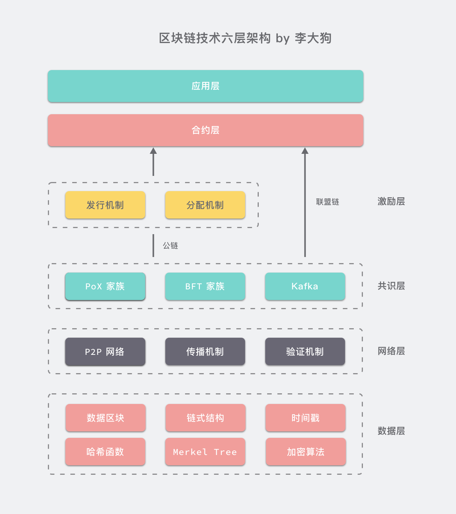

# Blockchain Advanced Course based on Jupyterlab
基于 JupyterLab 的互动式区块链进阶教程

**入门课程地址：**

  https://xue.cn/hub/app/books/3
  
**入门课程仓库地址：**

  https://github.com/albertschr/bitcoin_elementary_course_based_on_jupyterlab

## 进阶内容适合人群

希望在区块链领域有更深入发展的技术人员。

## 进阶内容涉及知识点

联盟链、分布式系统、计算机通信、数学、密码学、信息学与多语言编程。

## 区块链技术六层架构

本进阶课程将以六层架构为基础进行分析。

## 作者联系方式

作者微信二维码：

